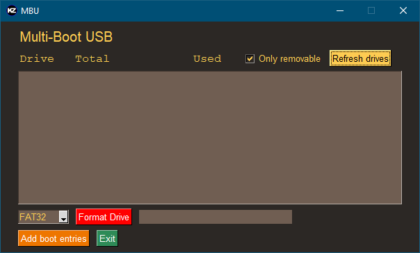

# MultiBootUsb

GUI application for quickly adding boot entries on MultiBoot USB devices

# Disclaimer
Entries were written for RHEL/CentOs, minor changes may be needed to run properly under Debian or other distros.

## Build from source
*Run [script](installer/installer.py) stored in installer folder*

# Usage
1. Select desired removable drive from the list
2. Click 'Add boot entries' button
3. Follow popup windows to finish the process

# What is required?
Python 3.5 or greater.

## [Dependencies](requirements.txt)
- [psutil](https://pypi.org/project/psutil/)
- [PySimpleGUI](https://pypi.org/project/PySimpleGUI/)

## License
This project is licensed under the MIT License - see the [LICENSE](LICENSE) file for details
